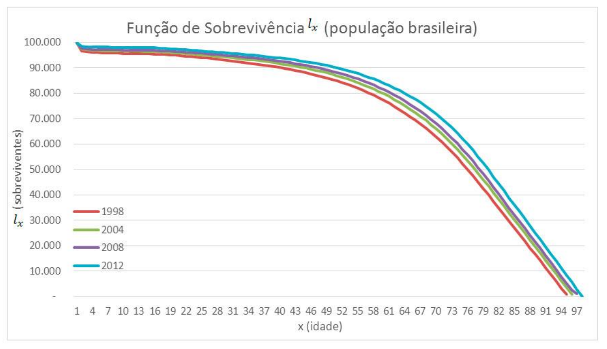

### Função de Sobrevivência  

\ \ \ \ \ \ Esta é uma das principais funções probabilísticas usadas para descrever estudos de sobrevivência. A função de sobrevivência é definida como a probabilidade de uma observação não falhar até um certo tempo t, ou seja, a probabilidade de uma observação sobreviver ao tempo t. Em termos probabilísticos, isto é escrito como:  

$$ S(t) = P(T ≥ t) $$   
\ \ \ \ \ \ Em consequência, a função de distribuição acumulada é definida como a probabilidade de uma observação não sobreviver ao tempo t, isto é, $F(t) = 1 − S(t)$.   
\ \ \ \ \ \ Ou seja, em um estudo médico onde o evento de interesse é a morte, a função de sobrevivência fornece a probabilidade de um indivíduo sobreviver além de um tempo $t$. A função de sobrevivência é uma função não crescente no tempo com as propriedades de que a probabilidade de sobreviver pelo menos ao tempo zero é $1$ e a probabilidade de sobreviver no tempo infinito é $0$. Para descrever a função de sobrevivência é geralmente utilizada uma representação gráfica de $S(t)$, ou seja, o gráfico de $S(t)$ versus $t$ que é chamado de curva de sobrevivência. Uma curva íngreme representa razão de sobrevivência baixo ou curto tempo de sobrevivência e uma curva de sobrevivência gradual ou plana representam taxa de sobrevivência alta ou sobrevivência longa.   

#### Função Sobrevivência  

\ \ \ \ \ \ Considere um indivíduo recém-nascido. A idade de morte desse indivíduo, $X$, é uma variável aleatória do tipo contínua. Seja $F(x)$ a função de distribuição de $X$  

$$ F(x) = P (X ≤ x ) \text{,   }x ≥0 $$ 
e seja 

$$s(x) = 1 − F(x) = P(X > x )  \text{,   } x ≥ 0 $$  
\ \ \ \ \ \  Vamos assumir sempre que $F(0) = 0$, que implica em $s(0) = 1$. A função $s(x)$ é chamada de função de sobrevivência. Para qualquer positivo $x$, $s(x)$ é a probabilidade de um nascido atingir a idade $x$. A distribuição de $X$ pode ser definida tanto pela função $F(x)$ como pela função $s(x)$.  

\ \ \ \ \ \ Usando as leis de probabilidade, podemos definir as probabilidades sobre a idade de morte em termos da função de sobrevivência ou em termos da função de distribuição. Por exemplo, a probabilidade de um recém-nascido morrer entre as idades $x$ e $z (x < z)$ é:  

$$  P(x < X ≤ ≤ z) = F(z) − F(x) $$   

\ \ \ \ \ \ ou 

$$ P(x < X ≤ z) = s(x) − s(z) $$  

\ \ \ \ \ \  Abaixo apresentaremos um exemplo de função de sobrevivência moldando uma coorte hipotética de 100.000 indivíduos através das probabilidades de sobrevivência e morte da população brasileira para 4 anos distindos (1998, 2004,2008 e 2012).  

\ \ \ \ \ \ Observe que a função se inicia num determinado momento no tempo, com 100% da população ainda viva e com saúde e nos permite calcular qual a percentagem dessa população ainda viva e com saúde noutros momentos ao longo do  tempo. 

\ \ \ \ \ \ A função de sobrevivência pode ser feita através da tábua de vida, tomaremos como exemplo 5 anos de uma coorte hipotética de 100000 habitantes cuja probabilidade de morte é dada por $\text{ }_n q_x$ . A função $S(t)$ calcula a probabilidadede um individuo de idade $x$ sobreviver até a idade $x+1$.   

| $X$ | $\text{ }_n q_x$ | $l_x$     | $S(t)$     |
|:---:|:----------------:|:---------:|:----------:|
|0    | 0,01260          | 100000    | 1          |
|1    | 0,00093          | 98740     | 0,9874     |
|2    | **0,00065**      | **98648** | 0,9865     |
|3    | 0,00050          | **98584** | **0,9858** | 
|4    | 0,00040          | 98535     | 0,9854     |
|5    | 0,00037          | 98496     | 0,9850     |
|6    | ...              | ...       | ...        | 

\ \ \ \ \ \ Tomemos como exemplo o segundo ano, se esperamos que $0,00065$ da coorte morram antes de completar $3$ anos uma vez que $98648$ indivíduos estão vivos, calculamos: $0,00065.98648 = 641212$ (são os indivíduos da coorte que sobreviveram até $2$ anos mas morrem antes de completar $3$), $98648 – 641212 = 98584$ (são os que chegaram vivos ao terceiro ano, sendo então $98584/100000$ a probabilidade de um indivíduo que desta corte chegar vivo ao terceiro ano.   

### Referências 

