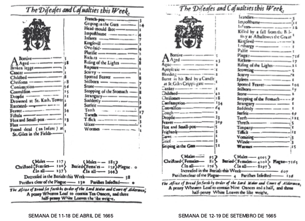

```{r setup, include=FALSE}
source("setup_knitr.R")
```

### As Tábuas de Mortalidade

\ \ \ \ \ \ As tábuas de mortalidade são instrumentos muito utilizados em diversas ciências como a demografia as ciências atuariais por exemplo. Conforme afirma Preston (2001, p.38), a tábua de mortalidade é uma tabela que mostra informações sobre a mortalidade de uma coorte. Em sua forma clássica, a primeira coluna desta tabela representa a idade (em anos) de uma coorte e todas as outras colunas representam funções relacionadas à mortalidade, como o número de sobreviventes em determinadas idades, taxas de mortalidade por idade, mortes em intervalos de idade etc. A tábua de mortalidade, também conhecida na literatura como tábua de vida, é uma maneira de modelar a mortalidade de uma coorte.

<div class="panel panel-primary">
  <div class="panel-heading">**As tábuas de mortalidade nos informam:**</div>
  <div class="panel-body">
  * Idade (em anos) de uma coorte
  * O número de sobreviventes em determinadas idades
  * Taxas de mortalidade por idade  
  * Mortes em intervalos de idade etc

</div>
</div>

\ \ \ \ \ \ Apenas para ilustrar a importância deste tipo de instrumento, é através dele que se obtém as informações sobre a expectativa de vida em determinada idade. Estas por sua vez, são utilizadas para realizar projeções populacionais e com isso, é possível discutir por exemplo, os atuais problemas previdenciários. Além disso, é conveniente lembrar que muitos produtos atuariais têm seus cálculos baseados nas informações presentes nas tábuas de mortalidade.  


### O surgimento

\ \ \ \ \ \ A história das tábuas de mortalidade se relaciona com a própria história do risco, que por sua vez contempla o desenvolvimento da estatística e as teorias da probabilidade. Entretanto, nem sempre a estatística foi relacionada com a demografia. Antes do século XVI por exemplo, estas eram disciplinas totalmente separadas. 

\ \ \ \ \ \ Em 1662 foi publicado o livro *Observações naturais e políticas sobre os registros de óbito*, cujo autor era John Graunt, um comerciante inglês. Graunt reuniu dados de nascimentos e mortes em Londres no período entre 1604 e 1661, e além destes dados seu livro trouxe suas interpretações. A obra de Graunt foi de extrema importância para o desenvolvimento do cálculo das probabilidades e para os métodos de amostragem. 

\ \ \ \ \ \ Como bom comerciante, o principal objetivo de Graunt era saber quantas pessoas haviam em Londres e suas características, como sexo, idade, religião, estado, profissão etc. e assim, possivelmente elaborar estratégias para seus negócios. Dados sobre nascimentos e mortes já eram registrados pela igreja há muito tempo mas não eram disponibilizados. 

\ \ \ \ \ \ No século XVII Londres enfrentava um processo significativo de crescimento econômico e populacional. Assim, Graunt percebeu que suas estatísticas representavam apenas uma pequena parte de todos os nascimentos e mortes que ocorriam. Ainda assim, ele conseguiu chegar a muitas conclusões sobre seus dados, com a maior precisão possível que seus conhecimentos e ferramental permitiam  na época. Este tipo de análise é conhecida atualmente como inferência estatística, que consiste em inferir uma estimativa para uma população com base em uma amostra. 

A imagem a seguir é parte do trabalho de Graunt. 



\ \ \ \ \ \ Graunt, mesmo sem saber, foi considerado como um dos cocriadores da ciência estatística devido a importância de seu trabalho. Uma curiosidade sobre a palavra estatística é que sua etimologia nos mostra que seu significado é uma análise de fatos quantitativos sobre o Estado.

\ \ \ \ \ \ Outro personagem de extrema importância tanto para a história da administração do risco quanto para outras ciências como a astronomia, foi o cientista Edmund Halley. No final do século XVII, Halley realizou um estudo mais aprofundado do que Graunt havia feito. Umas das especificidades de seu trabalho é que ele decompõe os dados populacionais em uma distribuição etária. De acordo com Halley, essa tabela gerava informações úteis até para o governo, como por exemplo o número de homens aptos a prestar serviço militar. Além disso, a tabela informava sobre qual a probabilidade de uma pessoa de idade $x$ morrer após algum número de anos, em outras palavras, sua tabela já apresentava os cálculos de esperança de vida em cada idade.

\ \ \ \ \ \ Dessa forma, a tabela de Halley se tornou de fundamental importância para o mercado de seguros. Com as probabilidades de vida e morte de cada idade era possível então precificar de maneira economicamente justa produtos atuariais, como seguros de vida e anuidades. As tabelas que continham as expectativas de vida desenvolvidas por Halley foram publicadas em 1693, entretanto, apenas um século mais tarde os governos e as seguradoras passaram a considerá-las em seus cálculos. Sua utilização prévia poderia ter evitado problemas econômicos para os governos, relacionados a previdência. 

### A composição de uma tábua de mortalidade


\ \ \ \ \ \ As tábuas de mortalidade são tabelas compostas por dez colunas, em que a primeira delas é a coluna das idades. Devido à algumas diferenças comportamentais e, em alguns casos até biológicas, existem tábuas de mortalidade que diferem o sexo feminino e masculino. Ou seja, mulheres e homens atravessam ao longo da vida, diferentes riscos de morte em todas as idades. Isso justifica a diferença de preços em produtos atuariais para ambos os sexos.  Mesmo com tais diferenças, existem tábuas de mortalidade que são construídas sem diferenciar o gênero. 

\ \ \ \ \ \ A segunda coluna de uma tábua de mortalidade é a probabilidade de morte à idade $x$ e $x+n$, representada por $_{n}q_{x}$. É calculada através da relação entre o número de óbitos observados no intervalo de idade $x$ e $x+n$, representado por ($_{n}D_{x}$) e o total da população neste intervalo de idade, representado por $_{n}l_{x}$. Ou seja: 
$$_{n}q_{x} = \dfrac{_{n}D_{x}}{_{n}l_{x}}$$
\ \ \ \ \ \ Outra coluna importante é a que diz respeito ao tempo médio vivido no intervalo etário pelos que morreram no intervalo $x$ e $x+n$, representado por $_{n}a_{x}$. É encontrado através da divisão do total do número de pessoas-ano vividos no intervalo $x$ e $x+n$ pelo total pessoas que morreram neste mesmo intervalo, ou seja
$$_{n}a_{x} = \dfrac{_{n}L_{x}}{_{n}D_{x}}$$

\ \ \ \ \ \ Para o cálculo da coluna anterior, é necessário a coluna $_{n}L_{x}$, que representa o número de pessoas-anos que viveram entre as idades $x$ e $x+n$. Esta é uma coorte hipotética que significa tempo a ser vivido pelos sobreviventes da coorte na idade x, entre esta idade e o início do próximo grupo etário. Então 
$$_{n}L_{x} = n \cdot _{n}l_{x+n} + _{n}A_{x}$$ 

em que $_{n}A_{x}$ representa o número de pessoas-ano vividos no intervalo pelos membros da coorte que morreram neste intervalo. 

\ \ \ \ \ \ Assim, uma maneira de se obter $_{n}D_{x}$ é então: 
$$_{n}D_{x} = L_{x} - L_{x+t}$$
\ \ \ \ \ \ A próxima coluna representa o tempo a ser vivido da coorte de idade x até que esta coorte se extinga, representada por $T_{x}$. É o número de pessoas-ano vividos a partir da idade x. É calculada por: 
$$T_{x} = \sum\limits_{t=0}^\infty L_{x+t}$$


\ \ \ \ \ \ Por fim, com todas as colunas anteriores é possível agora calcular a experança de vida à idade x, representada por $e_{x}^{\circ}$:

$$e_{x}^{\circ}=\dfrac{T_{x}}{l_{x}}$$

\ \ \ \ \ \ A união destas seis colunas resulta nas tábuas de mortalidade atualmente utilizadas para diferentes áreas da ciência. Abaixo segue uma pequena da tábua completa de mortalidade - Ambos os Sexos - 2016, do Brasil disponibilizada pelo IBGE. 

|   Idade  | $_{n}q_{x} \times 1000$ |  $_{n}D_{x}$  |   $l_{x}$  |  $_{n}L_{x}$ |  $T_{x}$   | $e_{x}^{\circ}$ |
|:--------:|:------------:|:---:|:-----:|:-----:|:-------:|:----:|
| 20       | 1,380        | 135 | 97665 | 97598 | 5611172 | 57,5 |
| 21       | 1,477        | 144 | 97530 | 97458 | 5513574 | 56,5 |
| 22       | 1,543        | 150 | 97386 | 97311 | 5416116 | 55,6 |
| $\vdots$ |$\vdots$|$\vdots$|$\vdots$|$\vdots$|$\vdots$|$\vdots$|

Normalmente as tábuas de mortalidade disponibilizadas não exibem as funções $_{n}a_{x}$, $_{n}m_{x}$ e $_{n}p_{x}$. Obs.: *$_{n}p_{x} = 1 - _{n}q_{x}$*.

\ \ \ \ \ \ Em demografia, as probabilidades de morte entre uma pessoa de idade $x$ e $x+n$ anos ($_{n}q_{x}$) normalmente são multiplicadas por mil afim de que os valores se tornem mais interpretáveis. Por exemplo, na tabela acima a cada mil pessoas entre 20 e 21 anos, a ocorrência de morte era de 1,38 pessoas no ano de 2016. Entretanto, para cáculos atuariais, estes devem continuar sendo valores probabilísticos e, então, a interpretação seria: a probabilidade de uma pessoa de 21 anos morrer antes de completar 22 anos, segundo esta tabela é de $\dfrac{1,380}{1000}=0,00138$, o que significa (por obviedade) que a probabilidade dessa mesma pessoa chegar viva aos 22 anos é de $1-0,00138 = 0,99862 = _{1}p_{22}$.

\ \ \ \ \ \ Uma observação a ser feita é que a construção de uma tábua de mortalidade é muito parecida com a construção das tabelas que atuários antigamente utilizavam, devido a impotência computacional, para realizar as técnicas de comutação.

### Tábuas de mortalidade no Brasil

\ \ \ \ \ \ As tábuas de mortalidade no Brasil são contruídas e disponibilizadas anualmente pelo Instituto Brasileiro de Geografia e Estatística - IBGE desde o ano de 1999, em cumprimento ao Artigo 2º do Decreto Presidencial nº 3.266, de 29 de novembro de 1999:

**“Art. 2°. Compete ao IBGE publicar, anualmente, até o dia primeiro de dezembro, no Diário Oficial da União, a tábua completa de mortalidade para o total da população brasileira referente ao ano anterior."**


\ \ \ \ \ \ De acordo com o IBGE, nas tábuas de mortalidade guardam informações de condições sociais da população, como sanitárias, de saúde e de segurança. Assim, este material também tem sua importância para o desenvolvimento de políticas sociais voltadas a sociedade.

\ \ \ \ \ \ Em cada divulgação feita pelo IBGE, também está contida a interpretação dos resultados. Além disso, o instituto também disserta sobre a evolução da mortalidade no Brasil e traz alguns resultados separados por estados brasileiros.

### Classificação das tábuas de mortalidade

\ \ \ \ \ \ Algumas tábuas de mortalidade são construídas sob a organização de alguns aspectos específicos da população estudada, como sexo, tipo de seguro, grupo de risco etc., e além disso por diferentes métodos. Assim, tábuas de mortalidade são classificadas de acordo com algumas dessas especifidades. 

\ \ \ \ \ \ As **tábuas contemporâneas** são tábuas cuja população é fictícia, normalmente 100.000 indivíduos e é sujeita as condições de mortalidade observadas para cada idade num determinado período de tempo. Se as informações são referentes a um único ano de calendário, define-se tábuas anuais. Se as probabilidades são contruídas com base na média de dois ou mais anos, denomina-se tábuas plurianuais. 

\ \ \ \ \ \ As **tábuas geracionais**, também chamadas de longitudinais, têm suas probabilidades calculadas com base num grupo de indivíduos (coorte) nascidos no mesmo ano. Para que isso aconteça, deve-se acompanhar estes indivíduos desde o seus nascimentos até as suas mortes. 

\ \ \ \ \ \ Uma outra classificação refere-se à forma com que estão dispostos os intervalos de idade na tábua. **Tábuas completas** contém dados para cada idade singular, desde o nascimento até o limite superior. **Tábuas abreviadas** formam grupos de idade.

\ \ \ \ \ \ Há também a classificação por idades de seleção. **Tábuas selecionadas** são tábuas em que as probabilidades são realizadas considerando a idade do indivíduo. **Tábuas finais** "correspondem à última coluna de uma tábua selecionada, ou seja, aquela em que se admite que a duração (ou período de seleção) deixa de ter efeito sobre a mortalidade" (Bravo, 2007).

\ \ \ \ \ \ Quanto ao tempo, as tábuas também podem ser **estáticas**, ou seja, todas as funções da tábua dizem respeito apenas a idade x. E ainda, podem ser **tábuas dinânimcas**, que as funções são indexadas, em linha, pela idade biológica e, em coluna, pelo ano de calendário (tempo cronológico).


### Referências 

- BERNSTEIN, P. L. **Desafio aos deuses**: a fascinante história do risco. Rio de Janeiro: Campus, c1997. xiv, 389 p. 
    
- BRAVO, J. M. Tábuas de mortalidade contemporâneas e prospectivas: Modelos estocásticos, aplicações actuariais e cobertura do risco de longevidade. **Universidade de Évora**, Évora, 2007.
    
- Intituto Brasileiro de Geografia e Estatística - IBGE. Tábua completa de mortalidade para o Brasil – 2016. Breve análise da evolução da mortalidade no Brasil. Disponível em: ftp://ftp.ibge.gov.br/Tabuas_Completas_de_Mortalidade/Tabuas_Completas_de_Mortalidade_2016/tabua_de_mortalidade_2016_analise.pdf. Acesso em 7 de Junho de 2018.

- PRESTON, S. H. **Demography:** measuring and modeling population processes. Malden, MA: Blackwell Publishers, c2001. 291 p.
